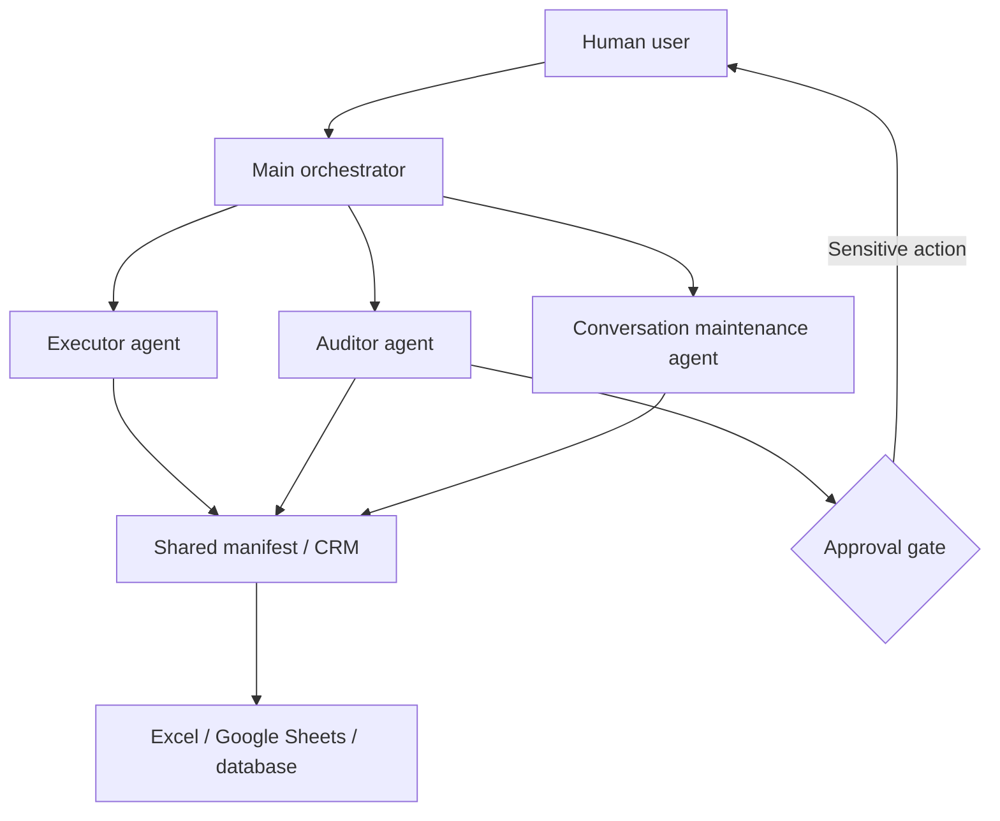

# Persona-Preserving LinkedIn Networking for Students

> Know why you want to connect before deciding whom to connect with. Preserve your own voice before using AI. Build a genuine relationship before asking for an opportunity.

[中文说明](docs/README.zh-CN.md) · [Architecture](docs/ARCHITECTURE.md) · [Privacy](docs/PRIVACY.md) · [Persona distillation: dot-skill](https://github.com/titanwings/colleague-skill)

## Why this project exists

Many Chinese international students invest heavily in resumes, applications, technical practice, interviews, and certifications, but have little awareness of professional networking. Without it, students can miss practical information about roles, teams, hiring needs, career paths, and skills that rarely appears in job descriptions.

This repository shares a method and reference architecture for learning how to:

- define a clear networking objective;
- identify relevant people on LinkedIn;
- start a specific, low-pressure conversation;
- preserve the user's authentic communication style when AI assists with drafting;
- follow up responsibly and maintain professional relationships;
- record, audit, and review each outreach round.

It is not a mass-messaging bot. It is a human-in-the-loop framework for thoughtful professional networking.

## Core ideas

### 1. Distill yourself before asking AI to communicate

Generic AI-generated notes are often overly polished, vague, and interchangeable. This framework begins with a separate persona layer that captures the user's real communication patterns, degree of formality, question style, boundaries, and non-native language texture.

The open-source [dot-skill](https://github.com/titanwings/colleague-skill) project can be used to create that persona layer. Never publish the resulting private persona or its source conversations.

```text
private persona + networking objective + verified profile context
                              ↓
                   personalized draft
                              ↓
                    review and approval
```

The objective is not to disguise AI use. It is to prevent AI from replacing the person with generic, over-polished language.

### 2. Set the objective before growing the network

Connection count alone is not a useful outcome. Each round should define a target mix based on the student's current goal.

| Target group | Example weight | Purpose |
|---|---:|---|
| Alumni | 30% | Lower the barrier to an initial conversation |
| People with a similar background | 25% | Learn reproducible career paths |
| Senior practitioners | 20% | Learn about skills and industry direction |
| Employees at target companies | 15% | Understand teams and company context |
| Hiring managers | 10% | Learn role expectations without immediately asking for a job |

These are example weights, not universal rules. They should change with career stage, industry, location, and the existing network.

### 3. Treat networking as relationship maintenance

The system records why a person was selected, what was discussed, the current conversation stage, when follow-up is appropriate, and which actions require approval. It avoids duplicate outreach, repeated questions, premature referral requests, and unnecessary follow-ups.

### 4. Keep a durable, reviewable record

The reference implementation uses a local Excel workbook as a lightweight CRM. The same structured state can be stored in Google Sheets, Airtable, Notion, or a database. The important property is not the tool: it is having a recoverable and auditable shared state.

## Reference architecture

The workflow uses a main orchestrator and three role-scoped agents:



- **Executor:** discovers candidates, verifies relevance, extracts evidence, and drafts low-risk messages.
- **Auditor:** independently checks identity, evidence, duplication, persona consistency, target mix, and permission boundaries.
- **Conversation maintenance:** tracks relationship stage, summarizes context, manages waiting periods, and escalates sensitive replies for human approval.
- **Main orchestrator:** defines each round, scopes context, coordinates agents, applies gates, and commits final state to the CRM.

See [ARCHITECTURE.md](docs/ARCHITECTURE.md) for responsibilities, quality gates, token controls, and the data flow.

## Human approval boundaries

AI may assist with research, classification, summarization, drafting, review, and reminders. Explicit user approval is required before:

- sending a resume or personal information;
- requesting a job, referral, meeting, or commitment;
- responding to sensitive or ambiguous content;
- acting when identity or conversation context is uncertain.

## Repository contents

```text
docs/        Method, architecture, and privacy guidance
schemas/     JSON Schema for a per-round shared manifest
templates/   Fictional persona and spreadsheet-ready CSV templates
examples/    A completely fictional example run
```

## Getting started

1. Define one concrete networking objective.
2. Create a private persona layer, or begin with `templates/persona.example.yaml`.
3. Choose target groups and weights for the round.
4. Copy `examples/round-manifest.example.json` and replace the fictional data.
5. Process a small batch, then run the quality gates described in the architecture document.
6. Record approved results in Excel, Google Sheets, or another CRM.
7. Review outcomes before changing the next round's targeting or communication style.

## Project boundaries

This project is not:

- a LinkedIn mass-messaging tool;
- a connection-count growth hack;
- an automatic referral-request bot;
- a guarantee of employment;
- a way to impersonate people or conceal automated behavior.

Users are responsible for protecting personal data and complying with LinkedIn's terms and applicable laws.

## License

MIT License. See [LICENSE](LICENSE).
